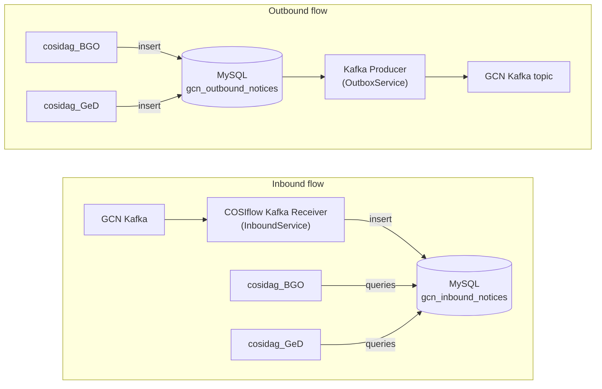

# Fast Transient Analysis Pipeline

The **Fast Transient Analysis Pipeline** (`fast-transient-analysis-pipeline`) is a
**Cosiflow module** that provides a set of Airflow DAGs and pipeline scripts for the
fast analysis of transient events (e.g. Gamma-Ray Bursts) observed by the
[COSI](https://cosi.ssl.berkeley.edu/) mission.

This README explains:

1. what a Cosiflow module is and how this repository is organized;
2. how to install Cosiflow **and** the Fast Transient Analysis Pipeline module on a
   new machine, using the bundled `install` script;
3. how the pipeline sends and queries alerts through the GCN client prototype.

> If you are looking for the general Cosiflow documentation about modules
> (creating, updating, removing, writing Dockerfiles, etc.), refer to
> [`cosiflow/env/README.md`](../cosiflow/env/README.md).

---

## Table of Contents

1. [What is a Cosiflow module?](#what-is-a-cosiflow-module)
2. [Repository structure](#repository-structure)
3. [Installation](#installation)
   1. [Step 1 — Create the workspace folder](#step-1--create-the-workspace-folder)
   2. [Step 2 — Clone the repository](#step-2--clone-the-repository)
   3. [Step 3 — Customize the runtime environment](#step-3--customize-the-runtime-environment)
      - [3.1 Docker container path (`env/Dockerfile`)](#31-docker-container-path-envdockerfile)
      - [3.2 External Python environments (`env/requirements_*.txt`)](#32-external-python-environments-envrequirements_txt)
   4. [Step 4 — Review the module configuration file](#step-4--review-the-module-configuration-file)
   5. [Step 5 — Run the install script](#step-5--run-the-install-script)
   6. [Step 6 — Fill in the prompts and wait](#step-6--fill-in-the-prompts-and-wait)
4. [DAG catalog](#dag-catalog)
5. [GCN client integration](#gcn-client-integration)
6. [After the installation](#after-the-installation)

---

## What is a Cosiflow module?

[Cosiflow](https://github.com/cositools/cosiflow) is the Airflow-based orchestration
environment used by the COSI collaboration to run scientific pipelines.

A **Cosiflow module** is a self-contained plug-in that adds new DAGs and pipeline
scripts to a running Cosiflow instance. Modules are *hot-loaded* into the Airflow
container by the `hot_load_module.sh` helper script, which:

- creates symbolic links from the Airflow `dags/` and `pipeline/` directories to the
  module sources (so Airflow discovers the new DAGs automatically);
- optionally creates one or more Python virtual environments inside the Airflow
  container (used by `ExternalPythonOperator` tasks);
- optionally builds a dedicated Docker image for the module (used by
  `DockerOperator` tasks).

The behaviour of `hot_load_module.sh` is driven by a YAML configuration file.
The hot-loader can detect config files in the module root or under `env/`.
For this module that file is
[`env/fta-pipe.config.yaml`](env/fta-pipe.config.yaml).

A standard Cosiflow module follows this directory layout (taken from
`cosiflow/env/README.md`):

```
your_module_name/
├── env/
│   ├── Dockerfile          # Container image definition
│   └── requirements.txt    # Python dependencies (optional)
├── src/
│   ├── dags/               # Airflow DAG definitions
│   │   └── *.py
│   └── pipeline/           # Pipeline scripts executed by tasks
│       └── *.py
└── <module>.config.yaml    # optional location for hot_load_module.sh configuration
```

The hot-loader also detects module config files stored under `env/`, which is the
layout used by this repository.

For the full description of the module structure and of the configuration file,
see the *Module Structure* and *Using Configuration Files* sections in
[`cosiflow/env/README.md`](../cosiflow/env/README.md).

---

## Repository structure

This module is organized as follows:

```
fast-transient-analysis-pipeline/
├── env/
│   ├── Dockerfile                     # Module Docker image (Python 3.12 + cosipy)
│   ├── requirements_cosipy.txt        # GeD/COSIpy environment
│   ├── requirements_bct.txt           # BCT/GDT environment
│   ├── requirements_nimcosipy.txt     # BGO non-imaging environment
│   ├── fta-pipe.config.yaml           # hot_load_module.sh configuration
│   └── bin/
│       ├── install                    # All-in-one bootstrap script
│       └── README.md                  # Installation and GCN credential guide
└── src/
    ├── dags/                   # Airflow DAGs (cosidag_*.py, cosipipe_*.py)
    │   └── README.md           # DAG catalog and runtime notes
    └── pipeline/               # Pipeline scripts called by the DAGs
```

The DAGs in `src/dags/` use the `COSIDAG` framework provided by Cosiflow and cover,
among others, light-curve generation, TS-map computation, GRB localization, T90
estimation and fast GRB time-series analysis (both as `DockerOperator` and
`ExternalPythonOperator` variants).

The current DAG IDs are documented in [`src/dags/README.md`](src/dags/README.md).

---

## Installation

The recommended way to install the pipeline on a fresh machine is to use the
bootstrap script [`env/bin/install`](env/bin/install). The script performs the
**full installation, including Cosiflow itself**: you do not need to clone or
configure Cosiflow separately.

The high-level workflow is:

1. create a `cosi/` workspace folder;
2. clone this repository inside it;
3. (optionally) tune the runtime environment of the module (Dockerfile and/or
   `requirements_*.txt`);
4. (optionally) tune the module configuration file `fta-pipe.config.yaml`;
5. run the `install` script;
6. answer the interactive prompts and wait for the build to complete.

### Step 1 — Create the workspace folder

By default the `install` script expects everything to live under `~/cosi/`. Create
the folder if it does not already exist:

```bash
mkdir -p ~/cosi
```

> If you want to use a different location, you can pass it later to the install
> script via the `-c <path>` (or `--cosi-path <path>`) option.

### Step 2 — Clone the repository

Clone the Fast Transient Analysis Pipeline repository **inside** the workspace
folder:

```bash
cd ~/cosi
git clone https://github.com/cositools/fast-transient-analysis-pipeline.git
```

After this step you should have:

```
~/cosi/
└── fast-transient-analysis-pipeline/
    ├── env/
    └── src/
```

The Cosiflow repository will be cloned automatically by the `install` script in
the next steps; you do **not** need to clone it manually.

### Step 3 — Customize the runtime environment

The pipeline can be executed in two complementary ways, depending on which
operator is used by the DAGs:

| Mode | Operator | Pros | Cons |
| --- | --- | --- | --- |
| **Docker container** | `DockerOperator` | Strong isolation, fully reproducible runtime | Heavier image, slower startup, more disk/RAM |
| **External Python venv** | `ExternalPythonOperator` | Lightweight, fast startup, simpler debugging | Less isolated (shares the Airflow container) |

Customize only the runtime paths that you plan to use. The checked-in module
configuration currently requests both the module container and its enabled
external Python environments (see Step 4).

#### 3.1 Docker container path (`env/Dockerfile`)

Edit [`env/Dockerfile`](env/Dockerfile) only if you intend to use the
`DockerOperator`-based DAGs (e.g. `cosidag_lcurve_dock.py`, `cosidag_tsmap_dock.py`).

Things you may want to adjust:

- the **base image** (`python:3.12-slim` by default);
- the list of **system packages** installed with `apt-get` (e.g. add libraries
  required by extra dependencies);
- the **`UID` / `GID`** ARGs at the top of the file. They are normally rewritten
  automatically by the `install` script to match your host user, so you usually
  do not need to touch them by hand;
- the Python dependencies installed inside the image (currently
  `requirements_cosipy.txt`).

This path is heavier on disk and CPU than the virtualenv path, but provides a
fully isolated runtime that is easier to reproduce on different machines.

#### 3.2 External Python environments (`env/requirements_*.txt`)

The module separates incompatible scientific stacks into dedicated
environments:

| Environment | Requirements file | Main use |
| --- | --- | --- |
| `cosipy` | [`env/requirements_cosipy.txt`](env/requirements_cosipy.txt) | GeD/COSIpy analysis |
| `bct` | [`env/requirements_bct.txt`](env/requirements_bct.txt) | Bayesian Blocks duration and BGO/GDT work |
| `nimcosipy` | [`env/requirements_nimcosipy.txt`](env/requirements_nimcosipy.txt) | BGO non-imaging localization |

Pin or change dependencies in the corresponding file. The hot-loader creates
each enabled environment with the Python version and `venv_path` declared in
`fta-pipe.config.yaml`. The Docker image currently installs the `cosipy`
requirements only.

### Step 4 — Review the module configuration file

The module ships with [`env/fta-pipe.config.yaml`](env/fta-pipe.config.yaml).
This file tells `hot_load_module.sh`:

- where to find the DAGs, the pipeline scripts and the Docker context;
- which Python virtual environments to create inside the Airflow container;
- whether to build the Docker image, the virtualenv, both, or none.

The relevant default content is:

```yaml
install_mode: both

paths:
  dags: src/dags
  pipeline: src/pipeline
  images: env

environments:
  cosipy:
    requirements: env/requirements_cosipy.txt
    venv_path: /home/gamma/envs/cosipy
    enabled: true
    python_version: "3.12"
  bct:
    requirements: env/requirements_bct.txt
    venv_path: /home/gamma/envs/bct
    enabled: true
    python_version: "3.11"
  nimcosipy:
    requirements: env/requirements_nimcosipy.txt
    venv_path: /home/gamma/envs/nimcosipy
    enabled: true
    python_version: "3.12"

default_environment: cosipy
```

The most relevant key is `install_mode`:

- `environment` — only create the enabled Python environments inside the
  Airflow container;
- `container` — only build the module Docker image;
- `both` — create the environments **and** build the Docker image (the current
  checked-in default);
- `none` — only link DAGs and pipeline scripts.

The `install` script does not override `install_mode`; it invokes the hot-loader
with the checked-in configuration. Edit the YAML before installation if you
want a lighter environment-only or container-only setup.

For a complete description of every field, see the *Using Configuration Files*
section in [`cosiflow/env/README.md`](../cosiflow/env/README.md).

### Step 5 — Run the install script

From the module root, simply run:

```bash
cd ~/cosi/fast-transient-analysis-pipeline/env/bin
./install
```

If your workspace is **not** under `~/cosi`, pass the actual path with `-c`:

```bash
./install -c /absolute/path/to/cosi
```

To install a particular Cosiflow branch, tag, or commit, pass it with `-r`:

```bash
./install -r <cosiflow-tag-or-branch>
```

The script automates the full bootstrap of Cosiflow **and** the installation of
this module. In order, it will:

1. **Clone Cosiflow** (`https://github.com/cositools/cosiflow.git`) into
   `<COSI_PATH>/cosiflow` and check out the selected ref (`dev` by default).
2. **Patch UID/GID** in the Cosiflow `docker-compose.yaml` and in
   `Dockerfile.airflow` so that the Airflow container user (`gamma`) matches
   your host user; this avoids permission issues on bind-mounted volumes.
3. **Configure the Airflow stack** by interactively prompting for the main
   `docker-compose.yaml` variables (admin password, host IP, admin username and
   email, MailHog and Airflow Web UI ports, PostgreSQL settings, GCN MySQL
   settings, and optional GCN Kafka credentials).
   Pressing *Enter* on a prompt accepts the default value shown in parentheses.
4. **Patch UID/GID** in this module's `env/Dockerfile` as well, again to match
   your host user.
5. **Pre-create the host directories** that will be bind-mounted as Docker
   volumes (`<COSI_PATH>/cosiflow/pipeline`, `<COSI_PATH>/cosiflow/data`,
   `<COSI_PATH>/envs`) so that they are owned by your user and not by `root`.
6. **Build the Cosiflow image stack** with `docker compose build` from
   `<COSI_PATH>/cosiflow/env`.
7. **Start the Cosiflow stack** in detached mode with `docker compose up -d`
   (Airflow webserver, scheduler, Postgres, MailHog, …).
8. **Hot-load this module** by running
   `./hot_load_module.sh fast-transient-analysis-pipeline install` from
   `<COSI_PATH>/cosiflow/env`. This creates the symlinks for DAGs and pipeline
   scripts, creates the enabled Python environments, and builds the module
   image when requested by `env/fta-pipe.config.yaml`.

### Step 6 — Fill in the prompts and wait

The script is interactive: at several points it will:

- ask you to type a value (with a sensible default in parentheses) — just press
  *Enter* to accept the default, or type your own value and press *Enter*;
- ask you to press *Enter* to continue between major steps — this gives you a
  chance to inspect the modified files and the build logs before proceeding.

The longest steps are the Cosiflow image build (step 6) and hot-loading the
module (step 8), which can build the module image and compile several
scientific packages. On a typical workstation the full run takes **tens of
minutes**.

When the script completes, you should see a final green log message and the
`hot_load_module.sh` summary; at that point Airflow will already be running
with the new DAGs being indexed.

---

## DAG catalog

The module currently ships one initializer DAG and several COSIDAG-based scientific
pipelines.

The detailed catalog is maintained next to the DAG files:

[`src/dags/README.md`](src/dags/README.md)

In short:

| DAG ID | Runtime style | Main role |
| --- | --- | --- |
| `init_pipelines` | `PythonOperator` + `DockerOperator` | Stage selected GeD or BGO inputs and create a run `products/` folder |
| `cosidag_BGO` | `ExternalPythonOperator` | BGO branch of the fast transient pipeline |
| `cosidag_GeD` | `ExternalPythonOperator` | GeD branch of the fast transient pipeline |

`init_pipelines` does not directly trigger downstream DAGs with a `TriggerDagRunOperator`.
Its Airflow form uses `pipeline_branch` (`GeD` by default, or `BGO`) and groups
the remaining fields into General, GeD input, and BGO input sections. It
creates/stages products under the selected destination directory; BGO always
uses `tdrss`, while GeD retains all existing destinations and performs the
background cut. The corresponding COSIDAG then discovers those products
through its configured `monitoring_folders`.

---

## GCN client integration

The Fast Transient Analysis Pipeline exchanges alerts through the GCN client
prototype included in the companion Cosiflow checkout. The prototype runs a
Kafka receiver, a Kafka producer, and a dedicated MySQL database. Full
architecture and schema documentation is in
[`cosiflow/gcn-client/README.md`](../cosiflow/gcn-client/README.md).

The integration uses a database boundary:



The DAG tasks therefore do not open Kafka connections. They can complete a
durable database transaction and let the GCN client independently receive,
validate, publish, audit, and retry notices.

### Send a COSI alert through the outbox

The final `GCN_BGO` and `GCN_GeD` tasks call
`gcn.outbox.queue_cosi_alert`. This helper:

1. builds a COSI initial-alert JSON payload from the pipeline products;
2. writes a copy of the JSON into the run product directory;
3. creates a stable idempotency key from the DAG/task/run identity;
4. inserts or updates a `queued` row in `gcn_outbound_notices`;
5. returns the outbox ID, topic, JSON path, idempotency key, and payload hash.

For example, a custom pipeline task can use the same helper:

```python
from gcn.outbox import queue_cosi_alert

result = queue_cosi_alert(
    pipeline="BGO",
    instrument="BGO Shields",
    dag_id="cosidag_BGO",
    dag_run_id=dag_run_id,
    task_id="GCN_BGO",
    trigger_time="2027-09-14T03:21:42.128Z",
    topic="gcn.notices.cosi.bgo.test.alert",
    source_product_dir=product_dir,
    source_config_path=config_path,
    products={
        "duration_result": duration_result,
        "significance_result": significance_result,
        "localization_result": localization_result,
    },
)

print(result["outbound_notice_id"])
```

The runtime needs `PyMySQL` and the `GCN_DB_*` variables supplied by
COSIflow. The current module requirements already include `PyMySQL`.

The producer later claims the queued row and validates it. With the prototype
defaults (`GCN_PRODUCER_ENABLED=false` and `GCN_DRY_RUN=true`), no notice is
sent to the external broker and the row becomes `dry_run_published`. Do not
enable real publication until the COSI topic, versioned schema, and
mission-producer credentials have been approved by the GCN team.

Inspect recent outbox rows from `cosiflow/env`:

```bash
docker compose exec gcn-mysql sh -lc \
  'mysql -u"$MYSQL_USER" -p"$MYSQL_PASSWORD" "$MYSQL_DATABASE" -e "
  SELECT id, created_at, status, topic, source_pipeline, dag_run_id, task_id,
         event_name, attempts_count, published_at, last_error
  FROM gcn_outbound_notices
  ORDER BY id DESC
  LIMIT 20;
  "'
```

The prototype also includes a complete example notice at
`cosiflow/gcn-client/examples/cosi-alert.test.json`. It is a test COSI initial
alert with trigger/alert times, classification, localization, rate/fluence
measurements, GeD significance, and triggered BGO shields.

### Inspect alerts received from other missions

The receiver stores every Kafka alert in `gcn_inbound_notices`, including the
original payload, Kafka coordinates, parse status, and normalized fields. A
quick database check is:

```bash
cd ~/cosi/cosiflow/env
docker compose exec gcn-mysql sh -lc \
  'mysql -u"$MYSQL_USER" -p"$MYSQL_PASSWORD" "$MYSQL_DATABASE" -e "
  SELECT id, received_at, topic, mission, instrument, event_name,
         COALESCE(trigger_time, isotime, alert_datetime, received_at) AS event_time,
         ra_deg, dec_deg, parse_status, validation_status
  FROM gcn_inbound_notices
  ORDER BY received_at DESC
  LIMIT 20;
  "'
```

Use the row ID to inspect the original and parsed payload:

```sql
SELECT id, topic, raw_payload, payload_json, validation_errors
FROM gcn_inbound_notices
WHERE id = <notice-id>;
```

Science tasks should normally call
`gcn.query.query_relevant_grb_notices(...)` instead of embedding SQL. It
constructs a UTC query window from the pipeline trigger/science interval,
searches the inbox for long/short GRB notices, and returns normalized notice
summaries. It is deliberately fail-open: a missing driver, unavailable
database, or schema problem produces a structured `unavailable` result rather
than failing the scientific task.

Useful query controls are:

- `GCN_QUERY_ENABLED` (default `true`);
- `GCN_QUERY_WINDOW_MARGIN_SECONDS` (default `60`);
- `GCN_QUERY_MAX_ROWS` (default `20`);
- `GCN_DB_HOST`, `GCN_DB_PORT`, `GCN_DB_NAME`, `GCN_DB_USER`,
  `GCN_DB_PASSWORD`.

For an authenticated integration test, first create
`cosiflow/env/.env` with your personal GCN Kafka client ID and secret, as
described near the top of
[`cosiflow/env/README.md`](../cosiflow/env/README.md). Never commit that file.

---

## After the installation

Once the script has finished:

- The Airflow Web UI is reachable at
  `http://<HOST_IP>:<AIRFLOW_WEBUI_PORT>` (defaults: `http://localhost:8080`)
  with the admin credentials you provided during step 5.3 of the installer.
- The MailHog Web UI is reachable at
  `http://<HOST_IP>:<MAILHOG_WEBUI_PORT>` (default: `http://localhost:8025`).
- Airflow may need **a few minutes** to scan the new DAGs before they appear in
  the UI. If they do not show up, see the *Troubleshooting* section in
  [`cosiflow/env/README.md`](../cosiflow/env/README.md) (in particular the
  `airflow dags list` diagnostic command).

To **update** the module after editing DAGs, pipeline scripts, the Dockerfile or
the requirements:

```bash
cd ~/cosi/cosiflow/env
./hot_load_module.sh fast-transient-analysis-pipeline update
```

To **remove** the module from the running Cosiflow instance:

```bash
cd ~/cosi/cosiflow/env
./hot_load_module.sh fast-transient-analysis-pipeline remove
```

For everything else — managing multiple modules, switching to the
`DockerOperator` path, writing your own DAGs on top of `COSIDAG`, troubleshooting
DAG discovery, etc. — refer to the main Cosiflow documentation in
[`cosiflow/env/README.md`](../cosiflow/env/README.md).
